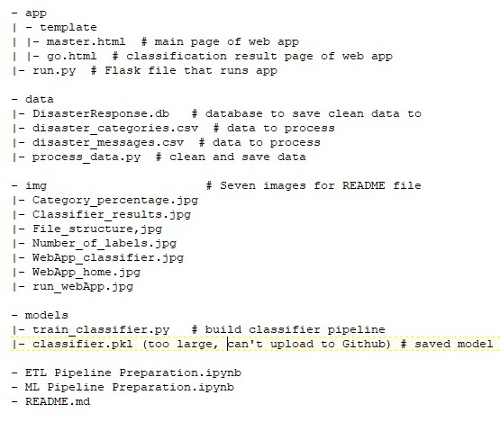
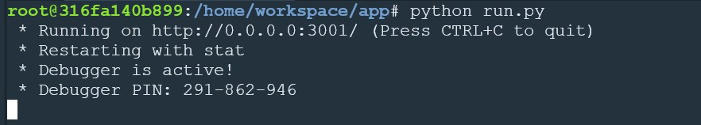

### Table of Contents

1. [Installation](#installation)
2. [Project Motivation](#motivation)
3. [File Descriptions](#files)
4. [Results](#results)
5. [Discussion](#discussion)
6. [Licensing, Authors, and Acknowledgements](#licensing)

## Installation 

There should be no necessary libraries to run the code here beyond the Anaconda distribution of Python.  The code should run with no issues using Python versions 3.*.

## Project Motivation 

This is my Udacity disaster responses classifier project. I was interestested in using disaster related messages from [Figure Eight](https://appen.com/) to:

1. better understand the category label for each message
2. build and optimize a pipeline to classify diaster related messages
3. Deploy the classifier into a webapp

## File Descriptions 

The file structure is as below:

There are two notebooks available here which are used to write two python files: process_data.py for data cleaning and train_classifier.py for building machine learning pipeline. The notebooks are doing the same thing as in the python files, but adding more Markdown cells and visualization to assist in walking through the thought process for individual steps.  

The "data" folder holds two csv data files used in process_data.py. The data is cleaned, combined and saved to DisasterResponse.db. The database is used in ./model/train_classifier.py to build the machine learning pipeline and also in ./app/run.py to run the web app. The optimized classifier model is save to ./model/classifier.pkl which will be called in run.py to run the web app. Note that classifier.pkl is too large to upload to Github, but you can always generate it yourself by running train_classifier.py. It may take more than 1 hour to get results depending on your computer power.

The web app has two templates in ./app/template: master.html and go.html which will be driven by run.py.

"img" folder just contains four images for this README file.

## Results 

There are three steps to run this projects:

### 1. ETL pipeline

- Load 'messages' and 'categories' dataset
- Merge the two datasets
- Clean and wrangle the data
- Stores the data into DisasterResponse.db

See more details in [./data/process_data.py](https://github.com/texcindy99/Disaster_Response_Pipelines/blob/master/data/process_data.py)

### 2. ML pipeline

- Load and further clean the data from DisasterResponse.db
- Split the data into training and testing data
- Build the machine learning pipeline using features from parallel text processing pipelines
- Train and optimize the classifier model using GridSearchCV
- Predict results on the test data
- Print out the test results and export the optimized model to classifier.pkl

The test results are shown in the image below:

See more details in [./model/train_classifier.py](https://github.com/texcindy99/Disaster_Response_Pipelines/blob/master/models/train_classifier.py)

### 3. Flask web app

- go to "app" directory in the terminal and Run run.py (python run.py)
- Check the web page

--If you are working in Udacity workspace:

Run your app with python run.py command until you see messages as in the image below:

Open another terminal and type env|grep WORK this will give you the spaceid (it will start with view*** and some characters after that)
Now open your browser window and type https://viewa7a4999b-3001.udacity-student-workspaces.com, replace the whole viewa7a4999b with your space id that you got in the previous step
Press enter and the app should now run for you

--If you are working on your local Machine:

Once your app is running (python run.py)
Go to http://localhost:3001 and the app will now run

The web page should look as below

Type in a message and press "Classify Message" button, you will see the web page showing the message labels as below:

## Discussion 

MultiOutputClassifier is chosen to classify the messages since one message may have more than one label categories as you can see in the image below.

The category data needs to be cleaned before feeding into the machine learning pipeline since 188 messages are labels as "2" in "related" category. After analyzing the data pattern, those "2" label are reset to "0".

The data is unbalanced as you can see in the image below. Majority of messages is labeled as "related" category. But 33 out of 36 categories are labeled as "1" in less than 20% of messages, which means those categories have much more "0" class than "1" class. furthermore, "child alone" category is "0" in all messages. This makes the classifier has no predicted samples in some cases and receive the warning "UndefinedMetricWarning: F-score is ill-defined and being set to 0.0 in labels with no predicted samples". After optimization, the weighted average F1-score is only 0.7 on the test data.  

Estimator LinearSVC() has better performance to deal with unbalanced data. But it can't take category which only has 1 class such as "child alone" are all "0". To use LinearSVC(), "child alone" category should be dropped off from the data for machine learning. To classify all 36 categories, RandomForestClassifier() is chosen as the estimator.

And if you want to deploy the web app on Heroku, please check this [Github repo](https://github.com/texcindy99/Heroku_Web_App_Development)

## Licensing, Authors, Acknowledgements 

Must give credit to [Figure Eight](https://appen.com/) and [Udacity data science nano degree course](https://www.udacity.com/course/data-scientist-nanodegree--nd025) for the data.  You can find the Licensing for the data and other descriptive information at [Figure Eight](https://appen.com/).  Otherwise, feel free to use the code here as you would like! 
